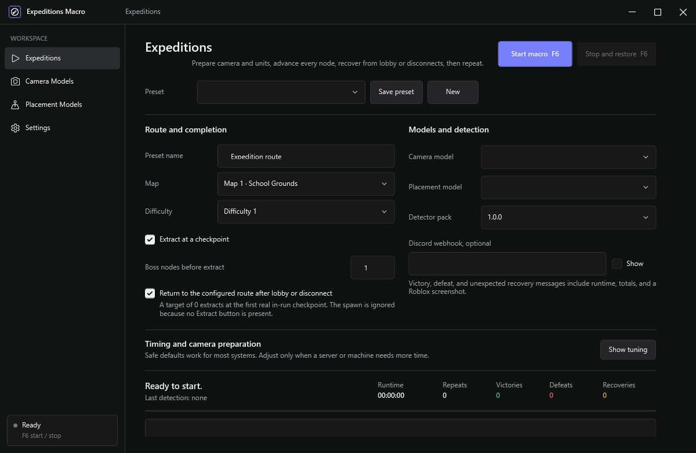

# Expeditions Macro

Expeditions Macro is a Windows desktop utility for repeatable Anime Expeditions runs in Roblox. It combines camera yaw alignment, editable unit placement, UI-state detection, lobby/disconnect/AFK recovery, checkpoint extraction, and optional Discord reporting in one native app.



It uses screen capture and ordinary Windows input. It does not inject into Roblox, read process memory, or bypass anti-cheat systems.

> This is an independent, noncommercial community project. It is not affiliated with Roblox Corporation, Anime Expeditions, or the game's developers. Automation may be restricted by a game or platform's rules; you are responsible for how you use it.

## What it does

- Starts with **F6** and stops safely with **F6**.
- Can begin from the Roblox lobby and navigate to the configured Expeditions map and difficulty.
- Fully zooms out, toggles shift lock, sets a top-down pitch, and aligns yaw against a learned full-turn camera model.
- Records, edits, saves, and tests Roblox-relative unit placements in one tool.
- Detects start, checkpoint, continue, confirmation, reward, victory, defeat, lobby, disconnect, and AFK Chamber screens.
- Detects reward cards from the stable reward overlay and available Select Upgrade controls, including layouts where a card is still collapsed or moving and regardless of rarity color.
- Extracts at the first real checkpoint or after a configured number of boss nodes. The spawn is not counted because it has no Extract action.
- Handles an early defeat even when extraction was planned later.
- Rejoins after a Roblox disconnect, an unexpected lobby teleport, or an inactivity teleport to the AFK Chamber. From the AFK Chamber it chooses **Return to Lobby**, then navigates back to the configured map and difficulty.
- Confirms recovery screens across consecutive captures before rejoining, so one animation frame cannot reset an active run or its checkpoint-extraction progress.
- Optionally sends Discord Components V2 reports with runtime, victory/defeat totals, recovery notices, and a Roblox screenshot.
- Records an unlimited timed Roblox screenshot sequence from Settings and packages the frames plus a manifest into one diagnostic ZIP.
- Stores webhook secrets with Windows DPAPI and emits no telemetry.

## Install

1. Open the [latest GitHub Release](https://github.com/LeniLilac/expeditions-macro/releases/latest).
2. Download `ExpeditionsMacro-<version>-win-x64-setup.exe`, or the portable ZIP.
3. Verify the file against `SHA256SUMS.txt` if desired.

Windows 10 or Windows 11 x64 is required. Release builds are self-contained; a separate .NET installation is not required.

Join the public [Expeditions Macro Discord](https://discord.gg/7NZhJZgHN3) for setup help, bug reports, model sharing, and release announcements. The same invite is available from the app sidebar.

## First-time setup

### 1. Create a camera model

1. Open **Camera Models** and choose **New model**.
2. Put Roblox at the repeatable world position, zoom, and pitch you want.
3. Choose **Select region** and drag over a stable, UI-free part of the Roblox client, such as the tower-defense track and nearby architecture.
4. Choose **Setup model**. The app arms the workflow without stealing focus.
5. Focus Roblox and press **F6**.

Leave shift lock off before pressing F6. Setup resizes the Roblox client to the standard 808 by 611 capture size, enables shift lock for stable right-mouse drags, and restores both when setup finishes, is stopped, or fails. Setup then takes several goal captures over time and learns one full yaw turn. If the coarse scan only finds a degraded wraparound view, setup verifies the following yaw view, fine-sweeps the provisional peak, and still requires a strong refined match before accepting it. The resulting atlas supports large shortest-path corrections when far from the goal and one-pixel refinement near it. Lighting normalization, temporal median capture, edge/gradient comparison, and tile trimming reduce sensitivity to lighting changes and moving units.

Camera regions are saved relative to the Roblox client. When using **Auto align** by itself, the app also manages shift lock automatically. It temporarily restores the recorded client size and returns the window to its original bounds afterward. If the fast yaw estimate misses its confidence target, alignment scans one complete turn and refines the strongest match. The Expeditions workflow does not place units unless the final result meets the model target. Use **Show 30% overlay** to visually confirm the result.

### 2. Create a placement model

1. Open **Placement Models** and choose **New model**.
2. Enter a name and choose recorded delays or a default interval.
3. Choose **Record placements**, focus Roblox, then press **F6**.
4. For each unit, press its top-row number and click the placement location.
5. Press **F6** again to finish and save.

Recording temporarily uses the same 808 by 611 Roblox client size as the detector pack and restores the original window afterward. Every row can be edited afterward: unit key, client-relative X/Y, and delay. **Test playback** replays the model through the same input path used during an Expedition run.

Saving the same name replaces the previous model.

### 3. Configure Expeditions

1. Open **Expeditions**.
2. Choose map, difficulty, camera model, placement model, and detector pack.
3. Enable checkpoint extraction and set **Boss nodes before extract**:
   - `0`: extract at the first real in-run checkpoint.
   - `1`: extract at the first checkpoint after one boss node.
   - A high value, or disabling extraction: continue until defeat/victory.
4. Leave automatic lobby/disconnect/AFK recovery enabled unless you intend to supervise navigation.
5. Optionally paste a standard, Canary, or PTB Discord webhook.
6. Save the preset and press **F6**.

The app waits for the difficulty carousel animation to settle and verifies the active difficulty before continuing.

## Runtime behavior

The main loop prepares the camera, places units, starts the node, and watches for:

- the next Start button;
- checkpoint, Continue, or confirmation actions;
- reward-card selection;
- unplaced hotbar units that need retrying;
- extraction when the boss target is met;
- victory or defeat, followed by retry;
- lobby, disconnect, or AFK Chamber recovery.

Stopping is cooperative. The app releases right mouse and shift-lock state where applicable, cancels pending work, and restores the original Roblox window bounds.

### Diagnostic screenshot capture

Open **Settings**, enter a capture name and interval under **Debug capture**, then choose **Arm capture**. Focus Roblox and press **F6** to start. Press **F6** again to stop. The app temporarily uses the standard 808 by 611 client size, restores the original Roblox bounds, and writes a same-name ZIP under `diagnostics/`. A completed same-name capture replaces the previous ZIP.

## Local files and privacy

Application data is stored under `%LocalAppData%\ExpeditionsMacro`:

- `camera-models/`
- `placement-models/`
- `presets/`
- `detector-packs/`
- `diagnostics/`
- `logs/`
- `settings.json`

See [PRIVACY.md](PRIVACY.md) for the exact network and screenshot behavior. Do not publish logs, models, or screenshots without reviewing them for account names, chat, notifications, or other private information.

## Build from source

Requirements:

- Windows 10/11 x64
- .NET SDK 10.0.302 or a compatible later 10.0 patch
- Git
- Inno Setup 6 only when creating the installer

```powershell
dotnet restore ExpeditionsMacro.slnx
dotnet build ExpeditionsMacro.slnx -c Debug
dotnet test tests/ExpeditionsMacro.Tests/ExpeditionsMacro.Tests.csproj -c Debug
```

The repository includes the detector image dataset, so the standard test command runs both unit tests and the complete golden-image regression suite. See [datasets/README.md](datasets/README.md) for its structure and capture requirements.

Build release artifacts:

```powershell
.\scripts\Generate-Icon.ps1
.\scripts\Build-Release.ps1 -Version 1.0.11
```

The release script publishes the self-contained app, creates the portable ZIP, creates the detector-pack ZIP, optionally invokes Inno Setup, and writes SHA-256 checksums plus a dependency inventory.

Pushing a version tag runs the release workflow. After GitHub publishes the verified assets, the workflow sends a Components V2 announcement to the public Discord `#releases` channel using the encrypted `DISCORD_RELEASE_WEBHOOK_URL` repository secret.

## Project layout

See [docs/ARCHITECTURE.md](docs/ARCHITECTURE.md) for the layer boundaries and [docs/DETECTOR-PACKS.md](docs/DETECTOR-PACKS.md) for the update format.

## License

Source code is available under the [PolyForm Noncommercial License 1.0.0](LICENSE.md). Commercial use is not granted. Third-party game content and marks remain owned by their respective owners; see [NOTICE.md](NOTICE.md).
