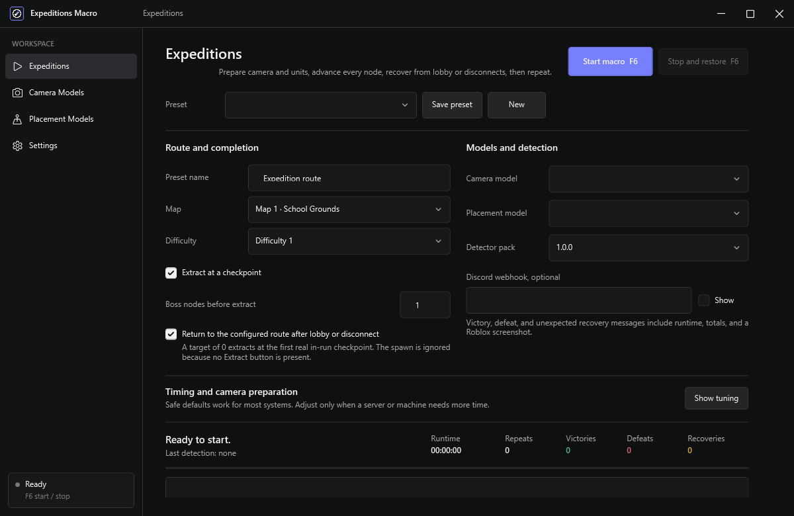

# Expeditions Macro

Expeditions Macro is a Windows desktop utility for repeatable Anime Expeditions, Challenge, Story, Raid, and supported Event runs in Roblox. It combines prioritized task plans, camera yaw alignment, editable unit placement, saved-team selection, UI-state detection, recovery, checkpoint extraction, and optional Discord reporting in one native app.



It uses screen capture and ordinary Windows input. It does not inject into Roblox, read process memory, or bypass anti-cheat systems.

> This is an independent, noncommercial community project. It is not affiliated with Roblox Corporation, Anime Expeditions, or the game's developers. Automation may be restricted by a game or platform's rules; you are responsible for how you use it.

## What it does

- Starts and stops with one configurable global hotkey; **F6** is the default, with letters, digits, punctuation, numpad keys, and supported function keys available.
- Starts only from the fully loaded Roblox lobby, then navigates to the configured mode, map, and difficulty.
- By default, checks Anime Expeditions' required Gameplay, Graphics, Units, and Misc settings before the first task and corrects mismatches after normalizing UI Scale to 1.00.
- Runs any enabled Trait, Stat, and Sprite Challenges on the global half-hour reset, recognizes five rotating maps, and loads the matching camera and placement models.
- Supports separate prestart and delayed in-match Challenge placements and configurable defeat retries; while Challenges are unavailable, the Macro scheduler selects the next eligible task by priority.
- Navigates Story Acts 1-5, Infinite, and Mastery across five maps, plus Spirit City Raid Acts 1-3.
- Navigates Villain Invasion Event Acts 1-4 from Lobby, including act-specific initial-load preparation and recoverable runtime guards: 12 minutes for Acts 1-3 and 17 minutes for the 25-wave Act 4.
- Saves prioritized Macro plans that can rotate Challenge, Expedition, Story, Raid, and supported Event routes while preserving progress between launches.
- Optionally opens Units and loads Team 1-8 before a configured run.
- Defaults to **Fast no align**, which fully zooms out, temporarily enables Shift Lock, sets a top-down pitch, and deliberately preserves the map's deterministic starting yaw. Learned camera models remain available for presets that need a custom yaw.
- Creates Roblox-relative unit placements directly on bundled 808 by 611 map screenshots, including an ordered before-Start or after-Start phase and an independent after-Start offset for every point. Fast placements must remain at least 7 client pixels apart. The legacy live recorder remains available with camera-model mode.
- Detects start, checkpoint, continue, confirmation, reward, victory, defeat, lobby, disconnect, and AFK Chamber screens.
- Captures the Roblox window directly instead of reading overlapping desktop windows, and normalizes HDR/Auto HDR pixels to SDR before detection.
- Detects reward cards from the stable reward overlay and available Select Upgrade controls, including layouts where a card is still collapsed or moving and regardless of rarity color.
- Extracts at the first real checkpoint or after a configured number of boss nodes. The spawn is not counted because it has no Extract action.
- Handles an early defeat even when extraction was planned later.
- Rejoins after a Roblox disconnect, an unexpected lobby teleport, or an inactivity teleport to the AFK Chamber. From the AFK Chamber it chooses **Return to Lobby**, then navigates back to the configured map and difficulty.
- Sends a safe `O` pulse every eight minutes during long-running gameplay and Challenge waits so normal inactivity does not reach the AFK Chamber.
- Detects the rare blue-void stage load before camera movement or placement, returns through Play, and retries the same task.
- Can optionally close only the verified Roblox player process and reopen a saved private server when bounded in-client recovery cannot restore the run.
- Confirms recovery screens across consecutive captures before rejoining, so one animation frame cannot reset an active run or its checkpoint-extraction progress.
- Optionally sends Discord Components V2 reports with a Roblox screenshot when each mode starts, per-match and whole-plan runtime on results, whole-plan victory/defeat totals that persist across mode changes, recovery notices, semantic state accents, and localized Discord timestamps. A configured Discord user ID receives five restricted mentions when a macro stops unexpectedly.
- Records an unlimited timed Roblox screenshot sequence from Settings and packages the frames plus a manifest into one diagnostic ZIP. Automatic failure diagnostics keep the latest 10 action-state frames and add 10 frames at half-second intervals after an unexpected macro error.
- Stores webhook secrets with Windows DPAPI and emits no telemetry.

## Install

1. Open the [latest GitHub Release](https://github.com/LeniLilac/expeditions-macro/releases/latest).
2. Download `ExpeditionsMacro-<version>-win-x64-setup.exe`, or the portable ZIP.
3. Verify the file against `SHA256SUMS.txt` if desired.

The portable ZIP contains one `ExpeditionsMacro` folder; run `ExpeditionsMacro.exe` from inside it. Windows 10 or Windows 11 x64 is required. Release builds are self-contained; a separate .NET installation is not required.

Follow the [Expeditions Macro setup guide](https://docs.google.com/document/d/10NeDNa3BNEwPEpZj0oVQiR98_7GN67dmKS-OZwaxALM/edit?usp=sharing) for a visual walkthrough. Join the public [Expeditions Macro Discord](https://discord.gg/wE6XSVyXsN) for setup help, bug reports, model sharing, and release announcements. Both links are available from the app sidebar.

## First-time setup

The instructions below refer to the **macro hotkey**. It defaults to **F6** and can be changed under **Settings > Controls** by clicking the key button and pressing a letter, number, punctuation key, numpad key, or supported function key.

Before starting a macro, assign Anime Expeditions' **Toggle Play Menu** action to one letter from A through Z. Under **Settings > Controls**, click **Toggle Play Menu key** and press that same letter. This setting intentionally starts empty, so the app shows an immediate setup popup and refuses to start until it is configured. Keep it different from the macro start/stop hotkey. The same key opens Play from the lobby as well as from Victory, Defeat, or an unstarted match, avoiding the small on-screen Play button. If three verified presses do not open Play, the macro stops with a setup popup instead of continuing through an unreliable click path.

Start every Macro plan from the fully loaded lobby with Play, Areas, Units, and the game Settings panel closed. **Check and fix game settings at macro start** is enabled by default under the app's Settings page. Before accessibility navigation, it temporarily uses the configured Shift Lock to point the camera straight down without changing zoom or yaw, preventing background world interactables from changing the focus path. It then opens Settings, normalizes the rendered UI Scale to the canonical size before performing scale-dependent Lobby detection, and verifies every required toggle. The required Graphics profile now also turns **Event Theme Enabled** off; this keeps the Lobby and route detectors on their retained visual theme. The standalone Debug UI Scale and game-settings actions use the same pitch-only preparation; UI Scale can run from any fully loaded game state and does not require Lobby. Controls without a required state are left untouched. The macro stops before sending route input if the lobby, panel, page, scrollbar, or a required toggle cannot be verified. You can disable the automatic correction, but the stable-lobby start requirement still applies.

Keep the Windows display scale at **100% on the monitor containing Roblox**. Every operation checks that monitor before sending input and checks it again if Roblox is replaced or moved during a run. At any other scale, the app stops with the detected percentage and asks you to change that monitor to 100%, restart Roblox, and retry. This is separate from Anime Expeditions' in-game UI Scale; the macro validates but never changes the Windows setting.

If a Fast Placement Setup should load a saved Team, also assign the game's **Toggle Unit Inventory** action to a letter and record it as **Toggle Unit Inventory key** under Settings. Leave the setup's Team at **Don't change** when the active team should remain untouched. Legacy camera-model presets retain their own Team fields.

The **Toggle Cancel Unit Placement key** defaults to **Z**. Match it to Anime Expeditions' corresponding binding under **Settings > Controls**. Before every placement, the macro selects the intended slot, cancels it, then taps that slot three times to force a deterministic select/deselect/reselect state. Keep it different from every other control binding.

Set **Change Unit Targeting**, **Upgrade Unit**, and **Toggle Auto Upgrade Unit** to matching A-Z letters in both Anime Expeditions and **Settings > Controls**. These three controls intentionally start empty, and every macro start is refused until all three are configured. Every letter-based control, Toggle Shift Lock, and the macro hotkey must use a distinct key.

The **Toggle Shift Lock key** defaults to **Left Ctrl**. If Anime Expeditions uses a different Shift Lock binding, click that key under **Settings > Controls** and press the matching physical key. Left and right Shift/Ctrl are stored separately; letters, numbers, symbols, numpad keys, function keys, and common control keys are also supported.

**Restart Roblox at Macro start** is enabled by default under **Macro > Roblox reconnect** and requires a valid private-server link. Each time you deliberately start a Macro plan, the app closes only a verified Roblox player process, opens that private server through the installed Roblox client, and waits for a stable Lobby before doing startup checks. It runs once for that Macro operation—not between tasks or loop runs. Disable it only when you want to keep the already-open Roblox session and will start from a clean Lobby yourself.

### 1. Choose a camera workflow

**Fast no align is enabled by default.** It uses each map's repeatable starting yaw, so no Camera Model is required. Camera Models and the four legacy preset editors stay hidden. **Placement Setup** organizes routes into collapsed map categories. Select an Expeditions or Story-map category to create one shared fallback, then add a child route only when that map, act, or mode needs an override. Macro Plan owns route policy such as Challenge types, difficulty, extraction, boss count, Hard mode, and defeat retries.

Fast no-align and camera-model placement files are intentionally incompatible. Fast no align resolves an exact route first, then its supported category fallback. Existing camera-model presets remain unchanged and continue to run. Turn off **Fast no align placement workflow** in Settings when you need to create or edit the legacy workflow.

For a custom per-map yaw, disable Fast no align and create a camera model:

1. Open **Camera Models** and choose **New model**.
2. Put Roblox at the repeatable world position and goal yaw. Leave shift lock off.
3. Choose **Setup model**. The app arms the workflow without stealing focus.
4. Focus Roblox and press the macro hotkey.

Leave shift lock off before pressing the macro hotkey. Setup uses the standard 808 by 611 client size, zooms fully out, enables shift lock with the key configured under Settings, sets a top-down pitch, takes six full-client goal captures over half a second, and automatically chooses four stable, detailed map regions outside the usual HUD zones. The regions span the left, center, and right of the map so one animated structure or lighting effect cannot dominate the comparison. Setup captures the signed one-pixel fine-yaw neighborhood, verifies its stationary return, then holds Right Arrow once while sampling a dense full-turn atlas at up to roughly 60 frames per second. Compact regional luminance, texture, and gradient fingerprints locate the returning neighborhood; an independently matching fine-yaw reference or an exact registered structural match confirms the loop before key-up and stationary correction. A short bounded pulse probe separately measures how dense visual positions map to this device's discrete arrow input. Normal setup targets less than 20 seconds, while a separate 120-second hard timeout protects against a permanently stalled capture or game. Runtime still uses bounded closed-loop arrow correction, saved fine-yaw correction, direct goal scoring, and three-frame final verification. Existing schema 3 models remain usable, while new dense models use schema 4. Schema 1 and 2 models cannot be migrated safely; create a current model, select it in each affected preset, and save the preset. Rebuilding a Macro plan does not replace a preset's camera-model reference. After two macro runs confirm the same load-in view, the app can try one locally learned mouse drag and verify the goal before falling back to normal atlas alignment; manual **Auto align** does not train or use this shortcut.

Camera regions are saved relative to the Roblox client and shown as colored outlines in the goal preview. When using **Auto align** by itself, the app also manages shift lock automatically and applies the recorded client size. If the fast yaw estimate misses its confidence target, alignment scans one complete arrow-based turn and refines the strongest match. The Expeditions workflow does not place units unless the final result meets the model target. Use **Show 30% overlay** to visually confirm the result.

### 2. Create a placement model

With Fast no align enabled:

1. Open **Placement Setup**. Select a category header to configure its shared fallback, or expand it and choose a child route to create an exact override. Raid acts remain direct routes because their maps differ.
2. Choose the saved Team for that category or route, or leave it at **Don't change**.
3. Choose a unit slot and **Before Start** or **After Start**.
4. Set each after-Start point's delay and targeting priority, then click the ordered placement points directly on the native 808 by 611 map screenshot. Use the 50–200% visual zoom when points are close together; scroll over the map to zoom and hold the middle mouse button while dragging to pan. Saved coordinates remain canonical. Points must be at least 7 client pixels apart; right-click a marker to remove it. Drag a row by its grip to reorder it, including edge-scrolling through a long list.
5. Use the gear beside the step actions to set the delay between placements and the default delay for new After Start points. Changing that default preserves existing points whose delay was customized.
6. Save the setup. **Test playback** prepares Fast no align, then replays the points through the production input path.

Each marker is labeled with its unit slot and `B` or `A` phase. Before-Start rows are always grouped above After-Start rows and can be reordered only within their own phase. Before-Start rows play before the runner deliberately clicks Start; After-Start rows play immediately after the match begins. Playback accepts a placement only after two stable frames show the selected-unit panel, then applies the configured targeting priority. If the panel is absent, it keeps the normalized unit slot and retries only a timed 50-pixel approach and click at that coordinate, up to eight attempts.

With Fast no align disabled, the legacy live recorder remains available:

1. Open **Placement Models** and choose **New model**.
2. Enter a name and choose recorded delays or a default interval.
3. Choose **Record placements**, focus Roblox, then press the macro hotkey.
4. For each unit, press its top-row number and click the placement location.
5. Press the macro hotkey again to finish and save.

Recording uses the same 808 by 611 Roblox client size as the detector pack. Every row can be edited afterward: unit key, client-relative X/Y, and delay. **Test playback** replays the model through the same input path used during a macro run.

Saving the same name replaces the previous model.

### 3. Configure a Fast no align Macro plan

1. Open **Macro**, create a plan, and choose a route directly.
2. Configure its victory/runtime target and route policy. Challenge tasks own enabled Challenge types and defeat retries; Expeditions own difficulty, extraction, and boss nodes before extraction; Story owns Hard mode and defeat retries; Raid and Event own defeat retries.
3. Add and order tasks. The first enabled, eligible row always runs next.
4. Optionally enable **Loop**, choose its start and stop rows, then select a finite number of runs or **Forever**. Tasks before the range run once, the range repeats without resetting lifetime totals, and tasks after it run after a finite loop completes.
5. Use **Export code** to copy the plan plus the exact overrides and category fallbacks it resolves to, including Placement Setup coordinates, Teams, targeting priorities, and loop configuration, as a compact `EMFAST1:` Base64 string. **Import code** validates and restores that same secret-free bundle on another device. Camera models, app settings, webhooks, private-server links, diagnostics, and task progress are never included.
6. Save the plan and press the macro hotkey.

The legacy sections below apply only after disabling Fast no align.

### 4. Configure legacy Expeditions

1. Open **Expeditions**.
2. Choose map, difficulty, camera preparation, and a compatible placement model. Fast no align is selected for new presets by default.
3. Enable checkpoint extraction and set **Boss nodes before extract**:
   - `0`: extract at the first real in-run checkpoint.
   - `1`: extract at the first checkpoint after one boss node.
   - A high value, or disabling extraction: continue until defeat/victory.
4. Leave automatic lobby/disconnect/AFK recovery enabled unless you intend to supervise navigation.
5. Optionally paste a standard, Canary, or PTB Discord webhook and use **Test webhook** to verify it. Add a numeric Discord user ID if unexpected errors should send five mention alerts.
6. Save the preset and press the macro hotkey.

The app waits for the difficulty carousel animation to settle and verifies the active difficulty before continuing.

### 5. Configure legacy Challenges

1. Open **Challenges** and enable any combination of Trait, Stat, and Sprite Challenges.
2. Choose camera preparation. In Fast no align, select one exact-map placement model per map; it contains both placement phases. In Camera model mode, choose a camera model, a before-start placement model, and an optional delayed placement model for each map.
3. Set how many times a Challenge may retry after defeat. The default is zero; a failed entry becomes eligible again at the next global reset.
4. Optionally enter a Discord webhook and numeric user ID for five error alerts, save the Challenge preset, and press the macro hotkey.

The selector order is fixed by Challenge type. The macro recognizes the current map, skips entries without **Select Stage**, and resets its per-window attempts at `xx:00` and `xx:30`. In a Macro plan, an unavailable Challenge task returns to the shared game-mode selector so the scheduler can run the next highest-priority eligible task. If all three entries remain unavailable across a complete global reset, it treats the daily limit as reached.

Before-start coordinates that fall beneath the centered Start Game dialog cannot reach the map. The Challenge runner automatically places unobstructed rows first, clicks Start deliberately, then immediately plays only the covered rows. A placement point therefore cannot accidentally start the match.

### 6. Configure legacy Story or Raid

1. Open **Story** or **Raid** and create a named preset.
2. For Story, choose one of the five maps and an Act, Infinite, or Mastery route. Act routes can use Normal or Hard difficulty.
3. For Raid, choose Spirit City Act 1, 2, or 3.
4. Choose camera preparation and a compatible placement model. Fast no align uses one route-specific model containing both phases; Camera model mode retains separate before-start and delayed placement models.
5. Optionally choose Team 1-8, set defeat retries, and save the preset.

Story and Raid pages edit presets. Add the saved preset to a Macro plan to run it. Fast no-align phases play around the Start action; legacy before-start and delayed models retain their configured timing. Victory completes one scheduled attempt, while the preset's retry limit controls immediate retries after defeat.

### 7. Build a legacy Macro plan

1. Open **Macro**, create a plan, and add saved Challenge, Expedition, Story, or Raid presets.
2. Order tasks with **Up** and **Down**. The first enabled, eligible row always runs next.
3. Set a victory target for finite tasks. Challenge tasks recur after their global reset instead of completing permanently.
4. For an Infinite Story preset, the target can be runtime: it completes after the configured runtime has elapsed and that run ends in defeat.
5. Save the plan and press the macro hotkey.

The scheduler never interrupts a live match. It updates saved task progress only after the current runner returns control, then reevaluates priority. **Reset progress** clears victories, defeats, runtime, completion, and Challenge eligibility for the plan.

### Optional Roblox restart recovery

Under **Macro > Roblox reconnect**, paste either a modern Roblox private-server share link or a legacy `privateServerLinkCode` link. The same global protected link supports the default-on one-time startup reset and the independently configurable runtime restart recovery; it is not part of an individual plan or share code.

Normal in-client lobby, disconnect, AFK, party, and blue-void recovery remains the first path. Verified runtime/session failures—including a missing or resized Roblox window, startup Lobby/settings stalls, ignored UI transitions, team-scroll alignment failure, and navigation timeout—then use private-server recovery:

1. verifies the visible Roblox window belongs to a supported Roblox player process;
2. closes only that process;
3. launches the private server through Windows' registered `roblox://` protocol;
4. waits for a new verified Roblox PID; and
5. reruns the stable-Lobby startup check, reloads the saved plan, and retries the same incomplete task without adding progress.

An automatic diagnostic is saved before each restart. Recoverable errors do not emit the terminal Discord “stopped unexpectedly” ping. Invalid plans/models, unsupported detector layouts, a bad Play key binding, malformed private-server links, and the three-restarts-per-ten-minutes circuit remain hard stops. Without restart recovery enabled and a valid private-server link, a recoverable runtime exception must still stop because the app has no authorized rejoin destination.

This launch does not use a browser, stored account credentials, cookies, or process injection. The current Windows user must already be signed into the installed Roblox client. The private-server link grants access to that server, so it is protected with Windows DPAPI and excluded from logs and diagnostics.

## Runtime behavior

The Expeditions loop prepares the camera, places units, starts the node, and watches for:

- the next Start button;
- checkpoint, Continue, or confirmation actions;
- reward-card selection;
- unplaced hotbar units that need retrying;
- extraction when the boss target is met;
- victory or defeat, followed by retry;
- lobby, disconnect, or AFK Chamber recovery.

The Challenges loop navigates the fixed three-entry selector, recognizes the rotating map, runs its map-specific camera and two placement phases, handles Victory or Defeat, opens Play with the configured in-game key, and returns through **Change Gamemode**. When no selected Challenge is eligible, it returns through the verified game-mode selector and lets the Macro scheduler choose the next eligible task without depending on the small Play icon or hotbar layout.

Story and Raid runners navigate from Play to their configured route, optionally load a saved Team, align the camera, run the two placement phases, monitor their terminal states, and return to Play after Victory or the final Defeat. Expedition alone owns upgrade reward cards. The Macro scheduler consumes one result at a time and then selects the highest-priority eligible task.

Villain Invasion Event routes begin from a verified Lobby because Event is not present in Play. Acts 1–4 use their retained Fast no align placement setup; Acts 1–2 add one deterministic spawn movement on the initial load, while Acts 3–4 need none. Verified Repeat Stage handoffs preserve the camera, player position, and unchanged team. Event may hand off to a normal mode through Play, but a normal mode entering Event—or one Event act entering another—returns to Lobby first.

Leave shift lock off before starting a camera workflow. Camera preparation centers the pointer, uses the configured Shift Lock key before any pitch or fine-yaw mouse drag, and uses that same key during cleanup after success, cancellation, or failure.

Before yaw alignment, the app waits for stable rendered geometry in the saved camera regions. A prestart UI over a textureless blue world is treated as an incomplete stage load: no camera input or placement is sent, and automatic recovery returns through Play to retry the same route. Fine-yaw calibration uses the same atomic one-step right-drag gestures in both directions and verifies that the real zero pose survives a round trip before saving a model. A failed saved-neighborhood shortcut restores its pose and continues the current full-turn scan instead of recursively starting another rotation.

Stopping is cooperative. The app releases right mouse and shift-lock state where applicable, cancels pending work, and leaves Roblox at the standardized client size used for detection.

Roblox discovery verifies the owning player process instead of trusting a window title alone, so unrelated windows such as a Notepad document containing “Roblox” are ignored. If Roblox recreates its window during a teleport, the app refreshes the verified handle and retries focus. Standard sizing first keeps the normal window frame; when Windows or Roblox clamps that frame above 808 by 611, the app temporarily uses a verified borderless window so the exact client geometry can still be applied. The original frame style is restored when the app exits or an explicit bounds restore is requested.

### Diagnostic screenshot capture

Open **Settings**, enter a capture name and interval under **Debug capture**, then choose **Arm capture**. Focus Roblox and press the macro hotkey to start; press it again to stop. The app uses the standard 808 by 611 client size and writes a same-name ZIP under `diagnostics/`. A completed same-name capture replaces the previous ZIP. Enable the log option when a bug report needs both screenshots and the current run log.

Automatic failure capture is enabled by default. It retains the latest 10 action-state frames from the active macro, then captures 10 more Roblox-client frames at 0.5-second intervals after an unexpected Expeditions or Challenge error. These captures use timestamped ZIP names and do not run after a normal completion or manual Stop. The app keeps the 10 newest automatic error ZIPs and removes older ones; manual diagnostic ZIPs are not affected.

**Deep debug logging** is a separate, disabled-by-default option in Settings. Enabling it requires confirming a red storage warning because every operation can produce a multi-gigabyte ZIP. While enabled, every detector capture is retained, every high-level automation action captures the Roblox client immediately before and after the action, and every detector score/state, generated key/mouse event, and placement-recording input is written in the same ordered sequence. A failed or canceled action also receives a final best-effort frame. The archive contains sanitized app settings, the selected plan and presets, the active detector pack, the referenced camera/placement models, and a sanitized run log. A ZIP is finalized after success, cancellation, or failure and is never removed automatically. Discord webhook values, protected webhook material, Discord user IDs, and the active Windows username/profile path are excluded.

**Debug workspace** is another disabled-by-default Settings option. Enabling it reveals a Debug tab for isolated Play navigation, saved-team swapping, a configurable held-key test, experimental resource-refuel route calibration, current-screen inspection, Roblox client standardization, and a performance benchmark. The benchmark separates capture, mode detection, root-recovery detection, and total work for the selected production path, reporting average/p95 latency and the expected rate with the normal poll interval. The held-key test captures one supported physical key and a 1–120,000 ms duration, arms the operation, and begins only when the macro hotkey is pressed. It rejects the active macro hotkey and always releases the held key when stopped. Navigation tests start from an explicitly selected lobby or post-match state and stop at verified prestart before camera alignment, placement, or Start Game. Resource-refuel tests require the matching **Toggle Areas Menu key** under Settings and remain Debug-only: they are not Macro tasks and never run on a timer. Live checkpoint modes can run continuously, pause before each input action, or pause after every detector observation; Previous and Next review captured frames only, while Step authorizes one live boundary and Run resumes continuous execution. Debug tools use the same exclusive operation coordinator and produce ordinary Deep Debug archives when Deep Debug logging is enabled.

Developers can replay these archives with the source-only [Deep Debug Viewer](tools/ExpeditionsMacro.DeepDebugViewer/README.md), which synchronizes captured frames with nearby detector, workflow, and input events. The viewer is not included in release artifacts.

## Local files and privacy

Application data is stored under `%LocalAppData%\ExpeditionsMacro`:

- `camera-models/`
- `placement-models/`
- `presets/`
- `challenge-presets/`
- `story-presets/`
- `raid-presets/`
- `macro-plans/`
- `detector-packs/`
- `diagnostics/`
- `logs/`
- `settings.json`

See [PRIVACY.md](PRIVACY.md) for the exact network and screenshot behavior. Do not publish logs, models, or screenshots without reviewing them for account names, chat, notifications, or other private information.

## Build from source

Requirements:

- Windows 10/11 x64
- .NET SDK 10.0.302 or a compatible later 10.0 patch
- Git
- Inno Setup 6 only when creating the installer

```powershell
dotnet restore ExpeditionsMacro.slnx
dotnet build ExpeditionsMacro.slnx -c Debug
dotnet test tests/ExpeditionsMacro.Tests/ExpeditionsMacro.Tests.csproj -c Debug
```

The repository includes the detector image dataset, so the standard test command runs both unit tests and the complete golden-image regression suite. See [datasets/README.md](datasets/README.md) for its structure and capture requirements.

Build release artifacts:

```powershell
.\scripts\Generate-Icon.ps1
.\scripts\Build-Release.ps1 -Version 1.2.0
```

The release script publishes the self-contained app, creates the portable ZIP, creates the detector-pack ZIP, optionally invokes Inno Setup, and writes SHA-256 checksums plus a dependency inventory.

Pushing a stable `vX.Y.Z` tag runs the normal release workflow. After GitHub publishes the verified assets, the workflow normally sends a Components V2 announcement to the public Discord `#releases` channel using the encrypted `DISCORD_RELEASE_WEBHOOK_URL` repository secret. Maintainers can include `[skip discord]` in the tagged commit message to suppress that announcement. Prerelease tags such as `vX.Y.Z-beta.N`, `vX.Y.Z-alpha.N`, and `vX.Y.Z-rc.N` instead use the silent prerelease workflow, are marked as GitHub prereleases, do not become the latest stable release, and never send a Discord announcement.

CI runs fast tests, six golden-image shards, and dark/light UI snapshots as independent parallel jobs. Silent prerelease packaging also runs independently, so a beta can become downloadable before validation finishes. Any failing validation remains visible on the tagged commit and must be fixed before promoting the build to stable.

## Project layout

See [docs/ARCHITECTURE.md](docs/ARCHITECTURE.md) for layer boundaries, [docs/DEVELOPMENT.md](docs/DEVELOPMENT.md) and [docs/TESTING.md](docs/TESTING.md) for contributor policy, [docs/GAME-BEHAVIOR.md](docs/GAME-BEHAVIOR.md) for field-confirmed navigation, [docs/CHALLENGE-MODE.md](docs/CHALLENGE-MODE.md) for Challenge behavior, and [docs/DETECTOR-PACKS.md](docs/DETECTOR-PACKS.md) for the update format.

## License

Source code is available under the [PolyForm Noncommercial License 1.0.0](LICENSE.md). Commercial use is not granted. Third-party game content and marks remain owned by their respective owners; see [NOTICE.md](NOTICE.md).
